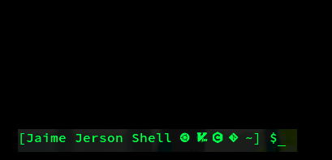
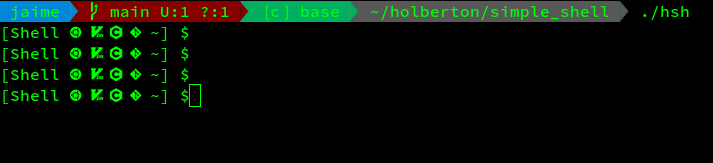
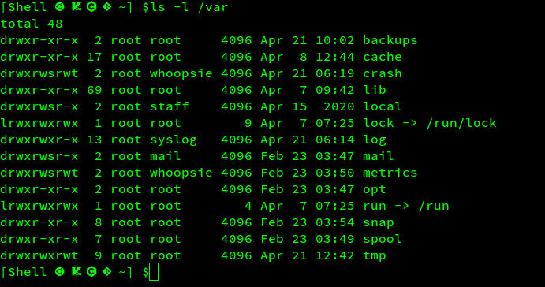
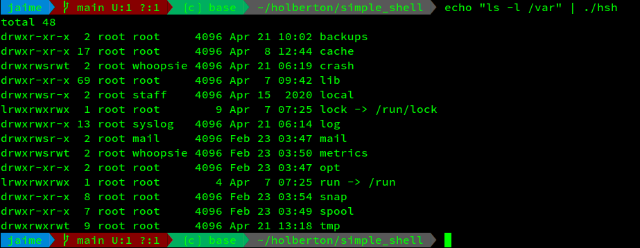

# Simple Shell - Draft




## Introduction
_________________________________________________________________
This repository is the development of a simple Unix Shell by Command Line Interface, implemented in C Language, and created by the Authors.  

This `shell` mimics the behaviour of the implemented Unix Shell `/bin/sh` but simple by definition, that is, althought it doesn't contain all functionalities of the original `sh`, the implemented functions must work in the same way as in the original `sh`.   

The files needed to work properly are added in the repository and must be compiled like this:

```
gcc -Wall -Werror -Wextra -pedantic -std=gnu89 *.c -o hsh
```

After compiling the call of the `shell` in the prompt of your bash is by default:

```
$ ./hsh
```




## Description
-----------------------------------------
The `shell` allows the interaction between the operating system and the user by means of instructions after the prompt in a **_Unix_** enviroment.    
Interactive and non-interactive modes are allowed, meaning, the non-interactive mode, as an execution via the `echo` command.

### Interactive mode



### The non-interactive Mode


In the same way:
- `ctl D`
- `ctl C`  
- `exit` 
- `env`
- ` \t\n` 

works properly, in the same way as in `sh`, and many others _edge_ cases.


## Support Files
-------------------------------------------
Support files constitutes the group of functions that make specific tasks grouped by its functionality. 
Various functions included on this support functions where made by the authors, with the same functionality of its C companion functions:
- Our `_calloc()` as `calloc()`
- Most of functions of the lib `<strings.h>` (`_strcpy()`, `_strlen()`, etc)

For more information, compare the functions with the `man` link.

The following table makes a descripcion the groups.

| Name | Description            |
|------|------------------------|
| helper_functions.c | Include files that manage strings, buffers etc.  |
| arguments.c | Include files that creates arguments to the executables |
| get_line.c | Include files that manage and tokens the entry buffer    |
| frees.c | Include files to free memory assigments            |


## Authors
-----------------------------------------------
Jerson Castro
Jaime Rodríguez Garzón 


